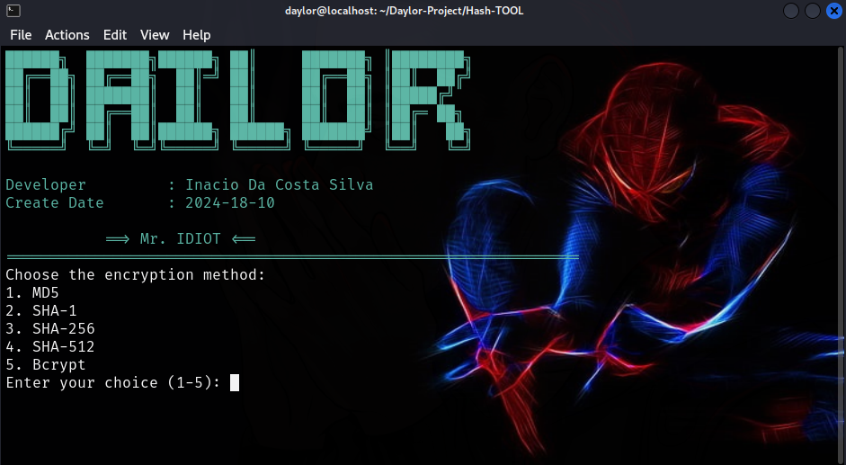

# Hash-TOOL



## About

This project is a [brief description of your project]. It provides [brief overview of functionality] and allows users to [key features].

## Features

- Feature 1
- Feature 2
- Feature 3

## Installation

1. Clone the repository:
   ```bash
   git clone https://github.com/your-username/your-repository.git
